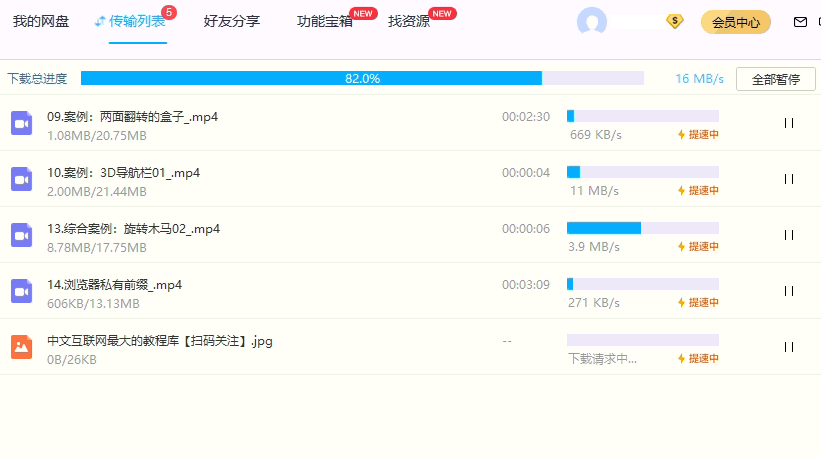
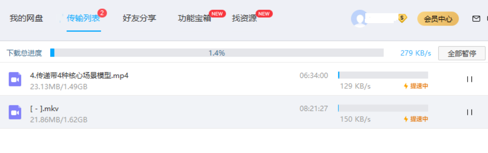
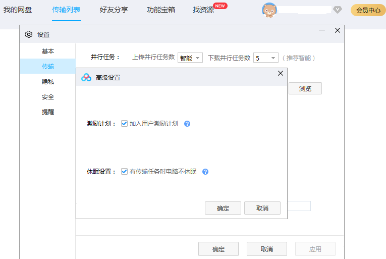
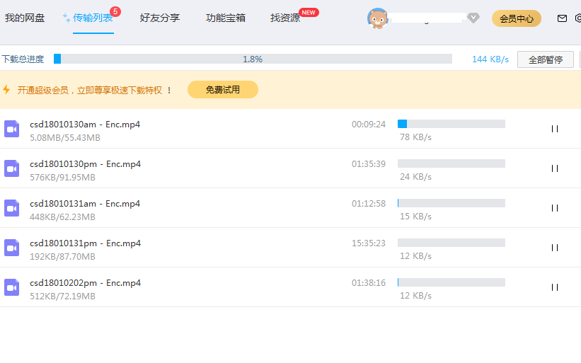

### VIP超级会员，正常网速，偶尔可以跑满宽带，大部分时候都可以到2MB/s以上，偶尔会因为文件比较冷门或者不知道什么原因，也会没速度（总之是跟文件有关，浮动很大）。总体上还是很快的  

  
  
### 当大量下载或者多地登录（共享VIP账号），总之是达到一定条件，VIP也会被限速，不管是几个文件同时下载，下载速度最大会被限制在1MB/s以内，平均上是400-600kb/s，最低的时候是100kb/s

  
    
### 非VIP，正常情况下下载，多个文件一起下载时，总速度一般在200kb/s，另外因为百/独=网客-户端本身有p2p功能，部分热门文件可以加速到400-600kb/s这样，这个是要看运气  

p2p就是你开着百/独=网客-户端，他就会自动上传，别的人从你的电脑下载部分文件内容。 跟迅雷一样，但是百/独应该是对p2p限制了（也可能是因为我电脑上文件太少），在我电脑上，上传速度并不很高，不影响我正常上网。迅雷前几年有一阵被骂，就是因为他上传的太快了，把宽带都占用了，开着迅雷不下载（p2p上传）都会导致不能在线看youku。因为宽带被它占满了。bd这点就做的挺好（再次备注，是在我的电脑上看的表现）
  
  
  

  
    
### 非VIP被限速，非VIP会员，不管你是什么方式（比如PanDownoad）下载数据的总体积达到一定值，就会被百=独限速了，这个时候传统的高并发下载，就没有啥速度了，因为你被限速了吗。限速后的下载速度，表现得并不稳定，我之前被限速时，下载速度（使用百/独=网客-户端下载）被限制在20-30kb/s 但是最近测试发现，现在限速是在100kb/s左右。可能百=独也在不断地调整，也可能是单纯的我下载的文件有问题，20-30kb/s  
  

## 别说我黑他，有截图吗，可能百=独随时在调整，但现在就是这个样子的
